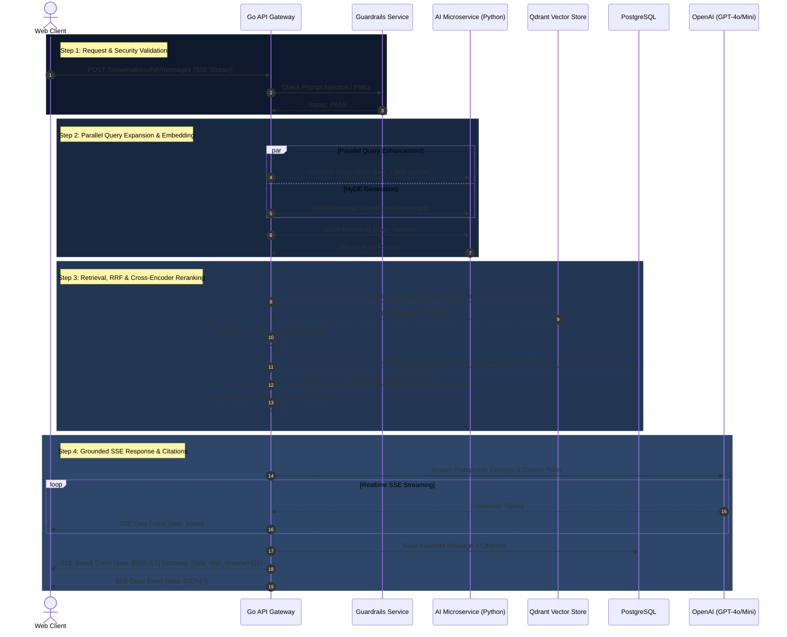

```mermaid
sequenceDiagram
    autonumber
    actor User as Web Client
    participant API as Go API Gateway
    participant Guard as Guardrails Service
    participant AI as AI Microservice (Python)
    participant Qdrant as Qdrant Vector Store
    participant DB as PostgreSQL
    participant LLM as OpenAI (GPT-4o/Mini)

    rect rgb(15, 25, 45)
    note right of User: Step 1: Request & Security Validation
    User->>API: POST /conversations/{id}/messages (SSE Stream)
    API->>Guard: Check Prompt Injection / Policy
    Guard-->>API: Status: PASS
    end

    rect rgb(25, 40, 65)
    note right of User: Step 2: Parallel Query Expansion & Embedding
    par Parallel Query Enhancement
        API->>AI: Enhance Query (Step-Back + Sub-queries)
    and HyDE Generation
        API->>AI: HyDE (Generate Hypothetical Document)
    end
    API->>AI: Batch Embed All Query Variants
    AI-->>API: Vector Array Returns
    end

    rect rgb(35, 55, 85)
    note right of User: Step 3: Retrieval, RRF & Cross-Encoder Reranking
    API->>Qdrant: Parallel Vector Search across all Variants
    Qdrant-->>API: Raw Matches Returned
    API->>API: Reciprocal Rank Fusion (RRF) Merge
    API->>DB: Fetch Full Chunks WITH Original Document Names & Timestamps
    API->>AI: Cross-Encoder Reranking (Top-K Selection)
    API->>API: Deduplicate Chunks by Content & Source
    end

    rect rgb(45, 70, 105)
    note right of User: Step 4: Grounded SSE Response & Citations
    API->>LLM: Stream Prompt with Excerpts & Citation Rules
    loop Realtime SSE Streaming
        LLM-->>API: Response Tokens
        API-->>User: SSE Data Event (data: token)
    end
    API->>DB: Save Assistant Message + Citations
    API-->>User: SSE Result Event (data: [RESULT] {citations: [{title, start_timestamp}]})
    API-->>User: SSE Done Event (data: [DONE])
    end
```