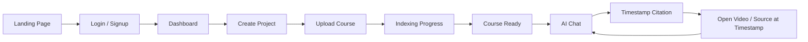

# 01 — Product Requirements

See [00-vision.md](./00-vision.md) for why this product exists before reading what it does.

## User Journey



The product is read left-to-right as a single funnel: **acquire → onboard → create → wait → converse → act**. Every feature below maps to one node above.

## Features

### Authentication
- Google OAuth login
- Email + password login
- JWT access token (short-lived) + refresh token (long-lived, rotated) — see [08-security.md](./08-security.md#jwt-rotation)
- RBAC — reserved for multi-team phase, not MVP

### Dashboard
- Projects list
- Course list per project
- Recent chats
- Upload progress (live)
- Storage usage meter

### Upload
- ZIP upload
- Drag & drop
- Individual file upload
- Live upload progress bar
- Resumable upload — future

### Course Processing
Shown to the user as a stepper. Backed by the state machine in [03-domain-model.md](./03-domain-model.md#course-lifecycle) and the pipeline in [04-indexing-pipeline.md](./04-indexing-pipeline.md):

```
Uploading → Extracting → Normalizing → Chunking →
Generating Metadata → Embedding → Indexing → Completed
```

### AI Chat
- Streaming token-by-token responses
- Markdown rendering
- Code syntax highlighting
- Inline citations
- Clickable timestamp links that seek the video/audio player
- Follow-up question suggestions

Backed by [05-query-pipeline.md](./05-query-pipeline.md).

### Course Management
- Rename / delete course
- Re-index course
- View processing logs (a filtered, user-safe view of the logs in [09-deployment.md](./09-deployment.md#observability))

## UI Build Prompt

A standalone prompt for generating the actual UI (visual direction, tone, screen list) lives in the separate `AI_Course_Assistant_UI_Prompt.md` file — paste it directly into a design/build tool. This doc defines *what* the product does; that file defines *what it should look and feel like*.
