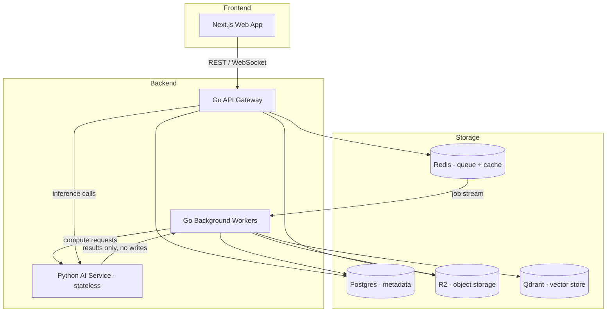
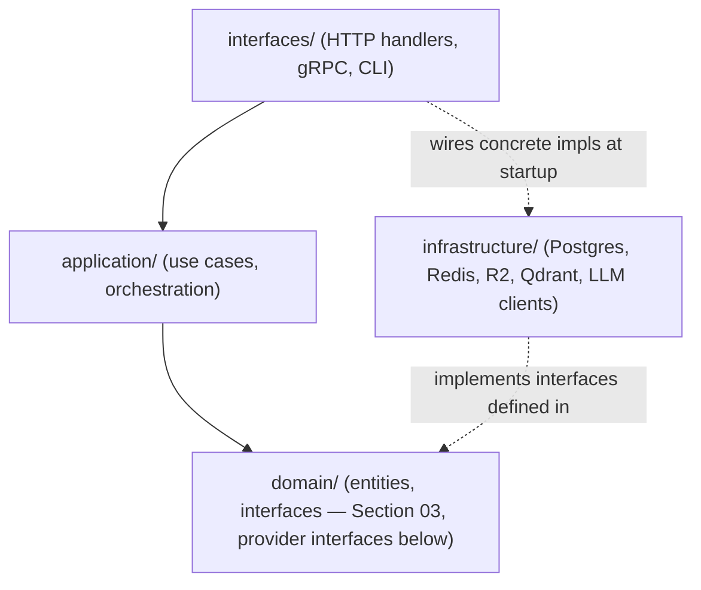

# 02 — System Architecture

## Overview



**Why this split:**
- **Go API** handles everything latency-sensitive and I/O bound (auth, CRUD, streaming responses to the browser).
- **Go Workers** own the entire indexing pipeline *and all persistence* — see the ownership correction below.
- **Python AI Service** is a stateless compute service: given inputs, it returns outputs (embeddings, generations, scores). It never decides what gets stored or where. See [06-ai-service.md](./06-ai-service.md).

See [ADR-001](./decisions/ADR-001-go-python.md) for why this split exists at all.

## Component Ownership

Explicit boundaries, so responsibility doesn't creep sideways as the codebase grows.

### Go API
**Responsible for:**
- Authentication, authorization
- CRUD (projects, courses, chats)
- Streaming responses to the browser (SSE/WebSocket)
- Triggering pipeline jobs

**Never:**
- Embeddings, chunking, or any ML computation
- Direct LLM calls (delegates to AI Service via the Worker or a thin proxy)

### Go Workers
**Responsible for:**
- Parsing, normalizing, chunking (see [04-indexing-pipeline.md](./04-indexing-pipeline.md))
- Calling the AI Service for title/summary/embedding generation
- **Writing all results to Qdrant and Postgres** — the AI Service never writes to storage itself
- Retry/backoff/dead-lettering (see [09-deployment.md](./09-deployment.md#error-handling))

**Never:**
- Serving end-user HTTP requests directly
- Owning the business decision of *where* data lives — that's Postgres/R2/Qdrant per [07-storage.md](./07-storage.md), but the *write* itself is always a Worker action

### Python AI Service
**Responsible for:**
- Embeddings, reranking, generation, evaluation — pure compute in, result out
- Nothing else

**Never:**
- Writing to Postgres, R2, or Qdrant
- Holding state between calls (fully stateless — safe to scale horizontally, reused by future workflows beyond course indexing)

> This is the one change from the earlier draft: the AI Service previously looked like it owned both inference *and* indexing. It doesn't — indexing (deciding what gets written where) is Worker orchestration; the AI Service only computes. Full detail in [06-ai-service.md](./06-ai-service.md).

### Storage Layer
See [07-storage.md](./07-storage.md) for what each store is responsible for.

## Module Dependency Diagram

Since the codebase follows Clean Architecture, dependencies must only ever point **inward** — `domain` depends on nothing, and nothing domain-level ever imports from `infrastructure`.



Rule: if you find yourself importing `infrastructure/postgres` from inside `application/`, that's a violation — `application/` should only ever depend on a `domain` interface (e.g. `CourseRepository`), and the concrete Postgres implementation gets injected at startup in `interfaces/` (or a dedicated `cmd/` wiring file).

## Code Layout

```
apps/
├── api/                  # Go API Gateway
├── worker/                # Go background workers
└── ai-service/            # Python AI service (stateless)

internal/
├── domain/                # entities + interfaces (Section 03, Provider Abstraction below)
├── application/            # use cases / orchestration
├── infrastructure/          # DB, queue, storage, LLM client implementations
└── interfaces/              # HTTP handlers, gRPC servers, CLI
```

```go
type DocumentParser interface {
    Parse(raw []byte, meta FileMeta) (*NormalizedDocument, error)
}

type Chunker interface {
    Chunk(doc *NormalizedDocument) ([]Chunk, error)
}
```

Adding PDF support later is `internal/parser/pdf` implementing the same `DocumentParser` interface — no changes to Worker orchestration code.

## Provider Abstraction

Vendor choice (OpenAI, a specific reranker, a specific guardrail vendor) is an implementation detail — the architecture names roles, not vendors.

```go
type LLMProvider interface {
    Generate(ctx context.Context, prompt Prompt) (Response, error)
    Stream(ctx context.Context, prompt Prompt) (<-chan Token, error)
}

type EmbeddingProvider interface {
    Embed(ctx context.Context, texts []string) ([]Vector, error)
}

type RerankerProvider interface {
    Rerank(ctx context.Context, query string, candidates []Chunk) ([]RankedChunk, error)
}

type GuardrailProvider interface {
    CheckPII(ctx context.Context, text string) (PIIResult, error)
    CheckInjection(ctx context.Context, text string) (InjectionResult, error)
}
```

| Role | MVP Provider | Swappable? |
|---|---|---|
| LLM (large) | one commercial API | Yes — behind `LLMProvider` |
| LLM (mini) | one commercial API, cheaper tier | Yes |
| Embedding | one commercial API | Yes — but requires re-embedding (see [Versioning Strategy](./04-indexing-pipeline.md#versioning-strategy)) |
| Reranker | one commercial or open-source model | Yes |
| Guardrails | one commercial API or self-hosted classifier | Yes |

Selection happens via config — see [09-deployment.md](./09-deployment.md#configuration-strategy).
