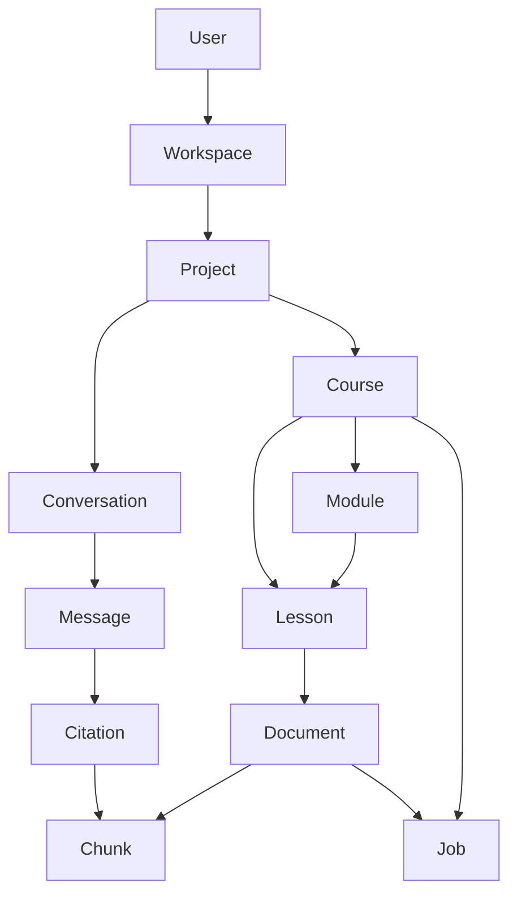
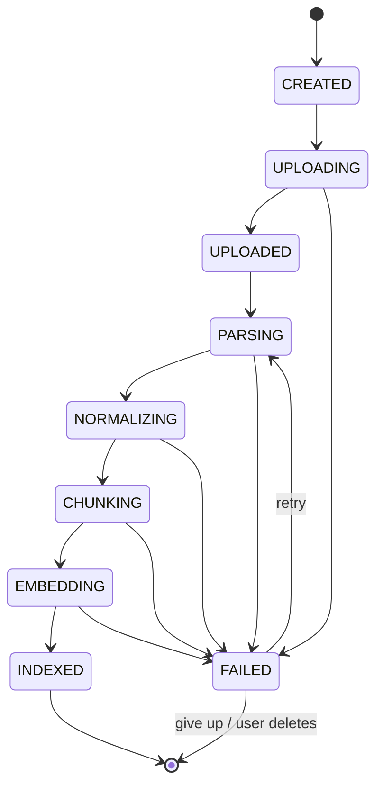
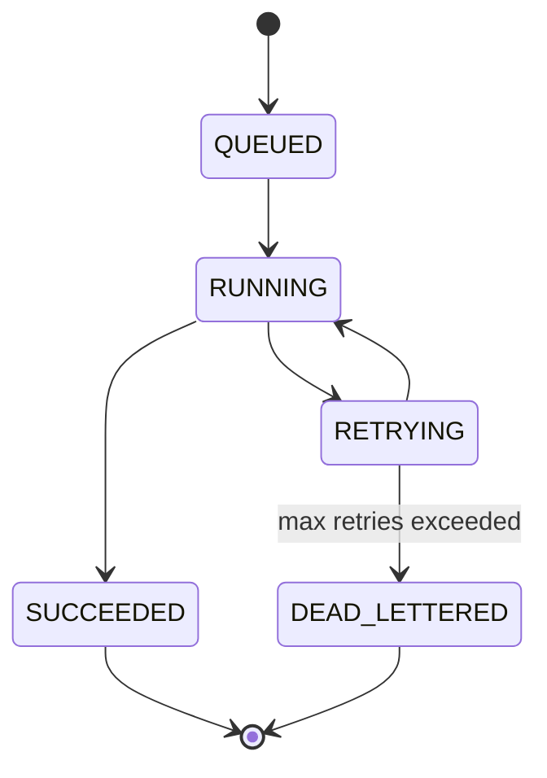
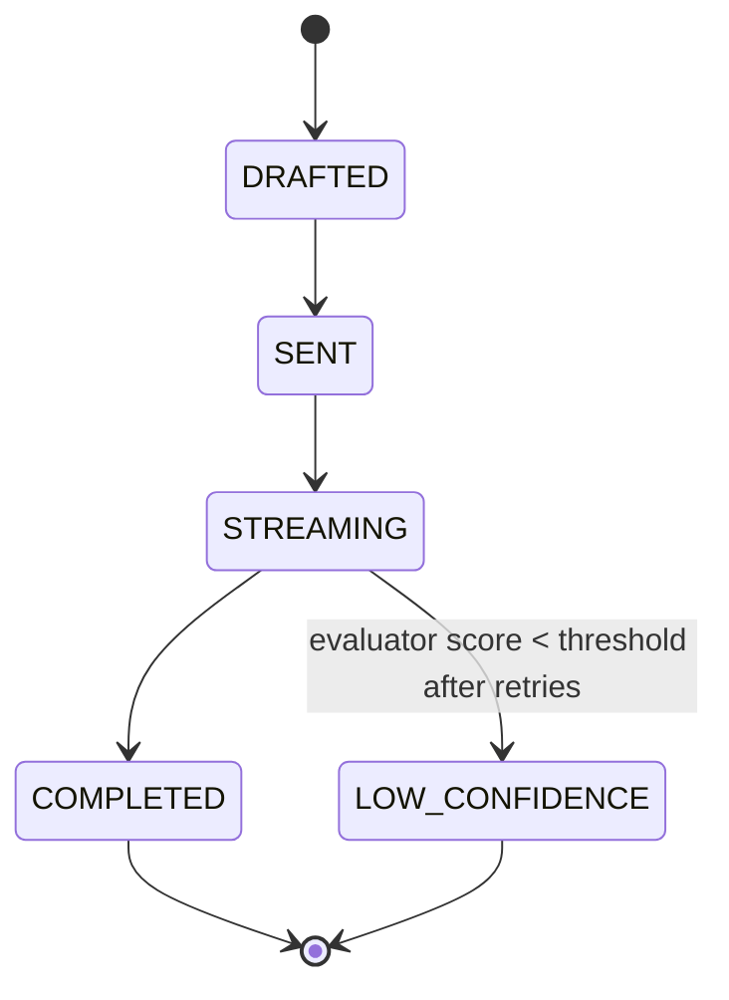
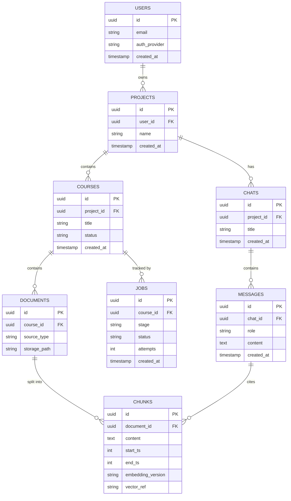

# 03 — Domain Model

This is the vocabulary of the whole system. Every table, event, and API contract traces back to one of these objects — if a new concept doesn't fit here, this doc gets updated first, not last.

## Entities

| Entity | Definition |
|---|---|
| **User** | A person with an account. Authenticates via Google or email/password. Owns Workspaces. |
| **Workspace** | The billing/ownership boundary for a user (or, later, a team). Reserved for the multi-team phase; in MVP it's 1:1 with User. |
| **Project** | A folder-like grouping of Courses and Chats — e.g. "Machine Learning Bootcamp." |
| **Course** | A single body of material (e.g. one course's transcripts). Has a lifecycle — see below. |
| **Module** | An optional logical grouping *within* a course (e.g. "Week 3") — reserved in the model for future use, not required for MVP. |
| **Lesson** | The unit that maps to one uploaded source file. A Course contains many Lessons. |
| **Document** | The raw uploaded artifact tied to a Lesson, plus its parsed form. |
| **Chunk** | A retrievable slice of a Document, with its own timestamp range, embedding, and metadata — see [04-indexing-pipeline.md](./04-indexing-pipeline.md#chunk-schema). |
| **Conversation** | A chat thread within a Project, containing an ordered list of Messages. |
| **Citation** | A pointer from a specific Message back to the Chunk(s) it was grounded in. |
| **Job** | A unit of background work (parse, chunk, embed, etc.) tracked through its own lifecycle, independent of Course state. |

## State Machines

### Course Lifecycle

### Job Lifecycle

Every stage in the Course pipeline is executed by a Job, tracked independently so you can answer "which specific step is stuck" without inferring it from Course status alone.

Full retry/DLQ policy: [09-deployment.md](./09-deployment.md#error-handling).

### Conversation / Message Lifecycle

Full retry/evaluator policy: [05-query-pipeline.md](./05-query-pipeline.md).

## Database Design

