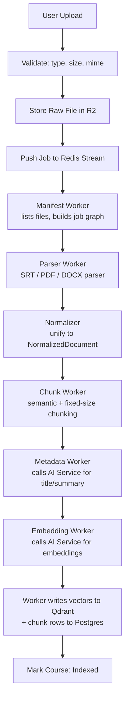
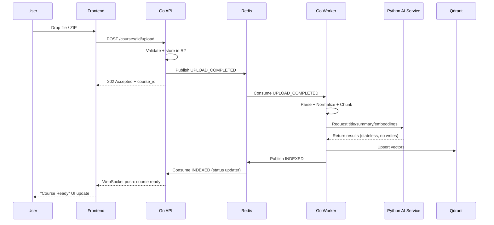

# 04 — Indexing Pipeline

Everything that happens between "user uploads a file" and "course is queryable." Owned end-to-end by Go Workers (see [Component Ownership](./02-system-architecture.md#component-ownership)) — the AI Service is called for compute steps but never writes results itself.

## Pipeline



Each worker is a separate consumer group on the Redis stream, so a slow embedding step never backs up parsing for other courses, and any single stage can be scaled or retried independently. Note the Metadata/Embedding workers *call* the AI Service and get results back, then do the writing themselves — see [06-ai-service.md](./06-ai-service.md) for why.

## Upload Sequence



## Event Contracts

Redis Streams are the event backbone (see [ADR-003](./decisions/ADR-003-redis-streams.md)). Every event has exactly one publisher and named consumers — undocumented events are how pipelines quietly rot.

| Event | Publisher | Consumer(s) | Payload (key fields) |
|---|---|---|---|
| `COURSE_CREATED` | Go API | Dashboard status updater | `course_id`, `project_id` |
| `UPLOAD_COMPLETED` | Go API | Manifest Worker | `course_id`, `document_ids[]` |
| `MANIFEST_READY` | Manifest Worker | Parser Worker | `course_id`, `job_graph` |
| `NORMALIZED` | Parser Worker | Chunk Worker | `document_id`, `normalized_ref` |
| `CHUNKED` | Chunk Worker | Metadata Worker | `document_id`, `chunk_ids[]` |
| `EMBEDDED` | Embedding Worker | Indexer (writes step) | `chunk_ids[]`, `embedding_version` |
| `INDEXED` | Indexer | Go API (status updater), Frontend (via WebSocket) | `course_id` |
| `FAILED` | Any worker | Go API (status updater), Alerting | `course_id`, `job_id`, `stage`, `error` |

Rule: a worker only ever consumes the event from the stage immediately before it, and only ever publishes the event for the stage it just completed.

## Internal Document Format

Every parser (SRT today, PDF/DOCX/video later — see [ADR-004](./decisions/ADR-004-normalized-document.md)) converges on one shape before anything downstream touches it.

```
NormalizedDocument
├── metadata
│   ├── source_type      (srt | pdf | docx | video | url)
│   ├── original_filename
│   └── checksum
├── language              (detected or declared)
├── source                (pointer back to raw file in R2)
├── timeline               (true for srt/video, false for pdf/docx)
├── normalization_version   (see Versioning Strategy below)
└── segments[]
    ├── segment_id
    ├── text
    ├── start_ts           (nullable)
    ├── end_ts              (nullable)
    ├── speaker             (nullable)
    └── page_number         (nullable)
```

The Chunk Worker only ever reads `segments[]` — it never re-parses the raw file. This one seam is what makes adding a new content type a matter of writing one new parser, not touching chunking, embedding, or retrieval at all.

## Chunk Schema

```
Chunk
├── chunk_id
├── document_id
├── start_timestamp        (nullable)
├── end_timestamp           (nullable)
├── page_number             (nullable)
├── title                  (short, generated — used in citation UI)
├── summary                 (1-2 sentence generated summary, used for reranking context)
├── content                 (the actual retrievable text)
├── token_count
├── embedding_version        (see Versioning Strategy below)
└── vector_ref               (pointer to the vector's ID in Qdrant, not the vector itself)
```

Rule: Postgres stores the Chunk row; Qdrant stores only the vector + a minimal payload (`chunk_id`, `course_id`, `start_timestamp`) needed to filter search. This keeps Qdrant cheap to rebuild from Postgres if the embedding model changes.

## Versioning Strategy

The one thing almost nobody plans for until it hurts: every stage of the pipeline can change independently, and old data must stay queryable while new data uses the new version.

| Version | Lives on | Why it matters |
|---|---|---|
| **Normalization Version** | `NormalizedDocument.normalization_version` | If parsing logic changes (e.g. better speaker detection), old normalized docs can be identified and reprocessed selectively |
| **Chunk Version** | Implicit via `Chunk` schema version in code | If chunking strategy changes (e.g. semantic vs. fixed-size), chunks from the old strategy can coexist during a rollout |
| **Embedding Version** | `Chunk.embedding_version` | Switching embedding models (e.g. provider change) requires re-embedding — this field lets you filter Qdrant queries by version during a migration instead of a hard cutover |
| **Prompt Version** | Tagged in AI Service requests/logs (see [06-ai-service.md](./06-ai-service.md#prompt-versioning)) | Lets you A/B or roll back a prompt change without redeploying code |
| **Pipeline Version** | Attached to each `Job` | If the whole pipeline shape changes (new stage added), lets you tell which jobs ran under which pipeline definition when debugging |

Rule: **never overwrite a version in place.** A migration always means "write new version alongside old, cut traffic over, then clean up" — never "mutate existing rows and hope."

## Roadmap

| Version | Addition |
|---|---|
| v1 | SRT transcripts |
| v2 | Video (direct upload + auto-transcription) |
| v3 | PDF |
| v4 | DOCX |
| v5 | GitHub repositories |
| v6 | Websites / URL ingestion |

Each addition is, by design, just a new implementation of `DocumentParser` producing a `NormalizedDocument` — nothing else in the pipeline should need to change.
