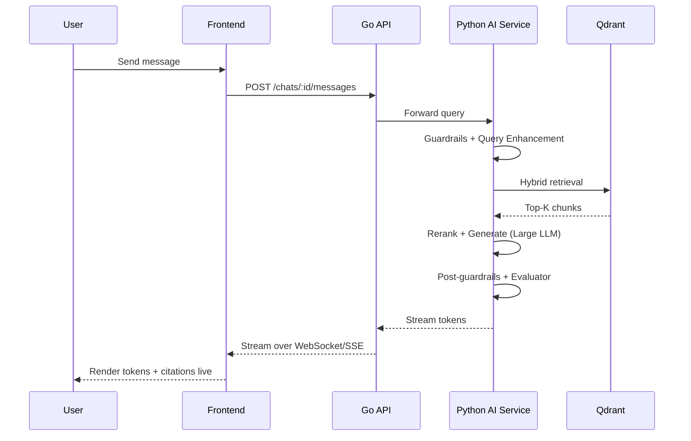
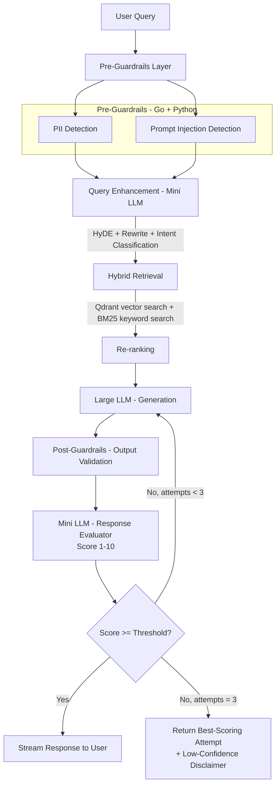

# 05 — Query Pipeline

The flow that runs every time a user sends a chat message. Hardened with pre/post guardrails and a bounded self-evaluation retry loop.

## Chat Sequence

Note: the AI Service does the compute (retrieval query, generation, evaluation) but the Go API is what persists the resulting `Message` and `Citation` rows — consistent with the AI Service being stateless (see [06-ai-service.md](./06-ai-service.md)).

## Pipeline Detail

### Design notes
- **Bounded retry exit:** after 3 attempts the pipeline returns the *best-scoring* attempt seen so far, tagged with a disclaimer, instead of looping indefinitely.
- **PII and injection detection run in parallel** since neither depends on the other's output.
- **Mini LLM used twice** (query enhancement, response evaluation) to keep cost/latency down; only generation uses the large model.
- **Hybrid retrieval** combines dense vector search with BM25 keyword search so exact terms (error codes, proper nouns) aren't lost to embedding similarity alone.

### Failure-mode table

| Stage | Failure | Mitigation |
|---|---|---|
| PII Detection | False positive blocks a valid query | Log + allow user to explicitly confirm and resend |
| Prompt Injection | Attempted jailbreak via uploaded content | Sanitize retrieved chunks before insertion into the prompt, not just the raw user query |
| Retrieval | No relevant chunks found | Return "not covered in this course" instead of forcing generation |
| Evaluator | Evaluator itself hallucinates a score | Retry cap (3) + fallback response prevents infinite cost |

See [09-deployment.md](./09-deployment.md#error-handling) for the general retryable/non-retryable error classification this extends.
