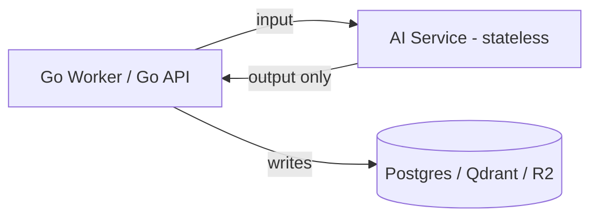
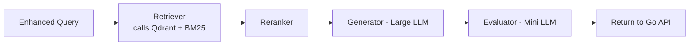

# 06 — AI Service

This will eventually be the most complex part of the platform, so it gets its own doc instead of staying a single box on the system diagram.

## Core Principle: Stateless Compute

The AI Service **computes and returns — it never persists.** Every function below takes inputs, returns outputs, and holds no state between calls. This is a deliberate correction from an earlier draft where the service looked like it owned both inference *and* indexing.

Why this matters:
- **Reusability** — the same stateless compute functions can serve indexing (Section: Indexing Internals) and querying ([05-query-pipeline.md](./05-query-pipeline.md)) and any future workflow, without carrying indexing-specific assumptions into query code.
- **Horizontal scaling** — a stateless service scales trivially; no coordination needed between instances.
- **Clear ownership** — Go Workers and the Go API decide *what happens to* an AI Service result (write to Qdrant, stream to a user, retry). The AI Service never makes that decision itself.

## Indexing-Time Internals

What today's single "Embedding Worker" box actually does, broken into its real steps:

The Go Worker then takes these results and writes them to Qdrant and Postgres itself (see [04-indexing-pipeline.md](./04-indexing-pipeline.md)) — the AI Service's job ends at `Return1`.

## Query-Time Internals

What "Large LLM" and "Mini LLM" actually cover, as a chain of stateless calls:

Full pipeline context (guardrails, retry loop): [05-query-pipeline.md](./05-query-pipeline.md).

## Interface

Every one of the boxes above is one implementation behind the provider interfaces defined in [02-system-architecture.md](./02-system-architecture.md#provider-abstraction) (`LLMProvider`, `EmbeddingProvider`, `RerankerProvider`, `GuardrailProvider`). The AI Service is the process that hosts these implementations; it is not itself an architectural layer that Go code reaches into directly — Go always talks to it through those interfaces over gRPC/HTTP.

## Prompt Versioning

Every request to the Generator or Evaluator is tagged with a `prompt_version`, logged alongside the result. This means:
- A prompt change can be A/B tested by version, not by redeploying the whole service.
- A regression can be traced to the exact prompt version that caused it.
- Rolling back a prompt is a config change (which version is "active"), not a code revert.

This is one entry in the broader [Versioning Strategy](./04-indexing-pipeline.md#versioning-strategy) — prompts version independently of embeddings, chunking, or normalization.
