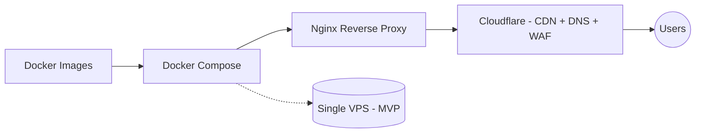
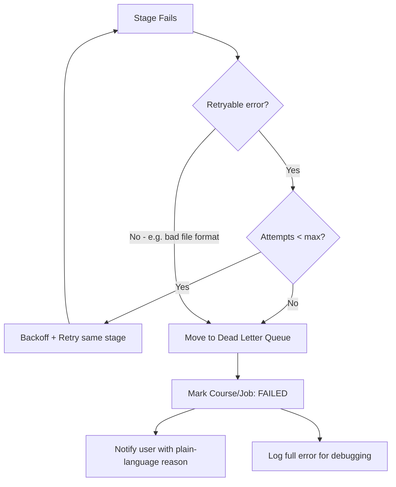

# 09 — Deployment, Configuration & Operations

## Deployment Architecture



MVP runs as a single VPS with Docker Compose. Split into managed services (separate DB, managed Redis, dedicated worker fleet) once traffic justifies it — the Clean Architecture boundaries in [02-system-architecture.md](./02-system-architecture.md) make this a config change, not a rewrite.

## Configuration Strategy

```
.env (per environment: local, staging, prod)
   ↓
config/ (typed config structs, one per service)
   ↓
validation (fail fast on boot if required config is missing/malformed)
   ↓
feature flags (toggle guardrails, retry counts, provider selection at runtime)
   ↓
provider switching (which concrete implementation backs each Provider interface)
```

Rules:
- No service reads `os.Getenv` directly outside of the `config/` package.
- Config validation happens at startup, not on first use — a missing API key crashes the service in seconds, not on the first user request.
- Feature flags (e.g. `guardrails_enabled`, `max_retries`) live in config so they change per-environment without a deploy.
- Provider selection (see [02-system-architecture.md](./02-system-architecture.md#provider-abstraction)) is itself a config value, e.g. `LLM_PROVIDER=openai`.

## Observability

| Pillar | What it covers | MVP approach |
|---|---|---|
| **Logging** | Structured logs per pipeline stage, correlated by `course_id` / `job_id` | JSON logs, one line per state transition |
| **Tracing** | Follow one request across Go API → Worker → AI Service | Propagate a `trace_id` through Redis events and gRPC calls |
| **Metrics** | Queue depth, job duration per stage, retry rate, evaluator score distribution | Basic counters/histograms, scraped by Prometheus or equivalent |
| **Health Checks** | Liveness/readiness per service | `/healthz` on API, worker heartbeat into Redis |
| **Audit Logs** | Who did what (delete course, re-index, login) | Append-only table in Postgres, separate from application logs |

The processing logs shown to end users ([01-product-requirements.md](./01-product-requirements.md#course-management)) are a filtered, user-safe view of these same structured logs — not a separate logging system.

## Error Handling



Rules:
- Retryable vs. non-retryable is classified per error type — e.g. a timeout calling the embedding API is retryable; a corrupt/unparseable SRT file is not.
- Dead Letter Queue (DLQ) holds failed jobs for manual inspection instead of silently dropping them or retrying forever.
- The user always gets a plain-language reason, sourced from the same structured logs above.
- This extends the Job state machine in [03-domain-model.md](./03-domain-model.md#job-lifecycle) (`RETRYING` → `DEAD_LETTERED`) and the `FAILED` event in [04-indexing-pipeline.md](./04-indexing-pipeline.md#event-contracts).

## Non-Functional Requirements

| Category | Requirement |
|---|---|
| Latency | First token of chat response < 2s p95 |
| Availability | 99.5% for API, best-effort for workers |
| Security | All PII detected pre-storage; encryption at rest (R2, Postgres) |
| Cost control | Mini LLM for all non-generation steps; retry cap of 3 on evaluator loop |
| Observability | Structured logs per pipeline stage; processing logs visible to end user |

## Milestones & Sprint Plan (suggested)

1. **Sprint 1–2:** Auth, project/course CRUD, dashboard skeleton, domain model implemented as DB migrations
2. **Sprint 3–4:** Upload → parse → chunk pipeline for SRT only, Course/Job state machines wired up
3. **Sprint 5:** Embedding + Qdrant indexing, event contracts implemented end-to-end
4. **Sprint 6–7:** Query pipeline end-to-end (no guardrails yet)
5. **Sprint 8:** Add pre/post guardrails + evaluator retry loop, error handling strategy
6. **Sprint 9:** Polish chat UI (streaming, citations, timestamp links), observability
7. **Sprint 10:** Hardening, provider abstraction validated with a second provider, deploy to VPS
