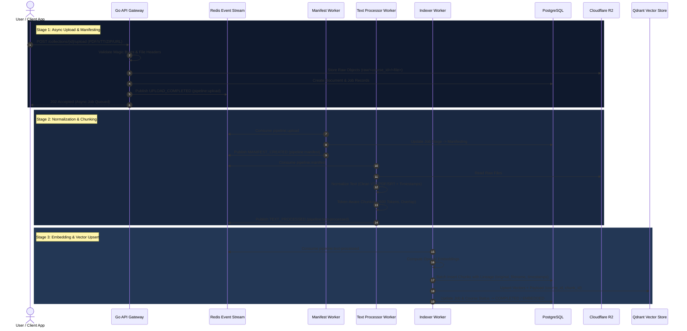

```mermaid
sequenceDiagram
    autonumber
    actor User as User / Client App
    participant API as Go API Gateway
    participant Redis as Redis Event Stream
    participant Manifest as Manifest Worker
    participant Processor as Text Processor Worker
    participant Indexer as Indexer Worker
    participant DB as PostgreSQL
    participant R2 as Cloudflare R2
    participant Qdrant as Qdrant Vector Store

    rect rgb(15, 25, 45)
    note right of User: Stage 1: Async Upload & Manifesting
    User->>API: POST /collections/{id}/upload (PDF/VTT/ZIP/URL)
    API->>API: Validate Magic Bytes & File Headers
    API->>R2: Store Raw Objects (raw/<course_id>/<file>)
    API->>DB: Create Document & Job Records
    API->>Redis: Publish UPLOAD_COMPLETED (pipeline:upload)
    API-->>User: 202 Accepted (Async Job Queued)
    end

    rect rgb(25, 40, 65)
    note right of User: Stage 2: Normalization & Chunking
    Manifest->>Redis: Consume pipeline:upload
    Manifest->>DB: Update Job Stage -> Manifesting
    Manifest->>Redis: Publish MANIFEST_CREATED (pipeline:manifest)
    
    Processor->>Redis: Consume pipeline:manifest
    Processor->>R2: Read Raw Files
    Processor->>Processor: Normalize Text (Clean VTT/PDF/SRT + Timestamps)
    Processor->>Processor: Token-Aware Chunking (500 Tokens, Overlap)
    Processor->>Redis: Publish TEXT_PROCESSED (pipeline:text-processed)
    end

    rect rgb(35, 55, 85)
    note right of User: Stage 3: Embedding & Vector Upsert
    Indexer->>Redis: Consume pipeline:text-processed
    Indexer->>Indexer: Compute OpenAI Embeddings
    Indexer->>DB: Batch Insert Chunks with Lineage (original_filename, timestamps)
    Indexer->>Qdrant: Upsert Vectors + Payload (course_id, chunk_id)
    Indexer->>DB: Update Job & Course Status -> COMPLETED / EMBEDDED
    end
```