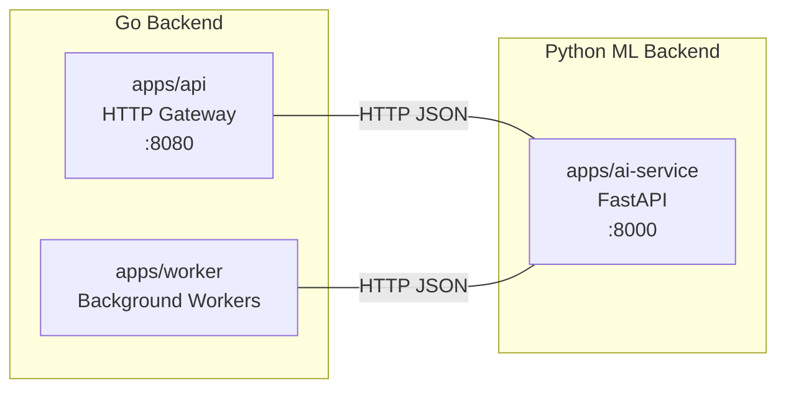
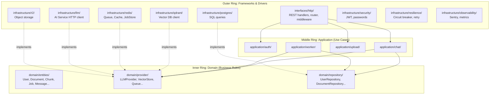
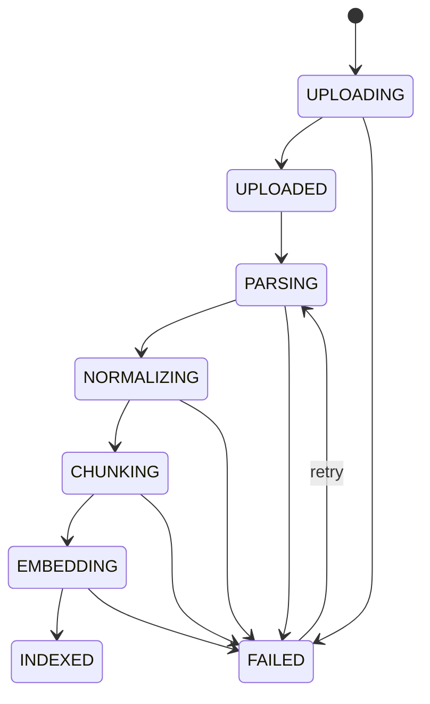
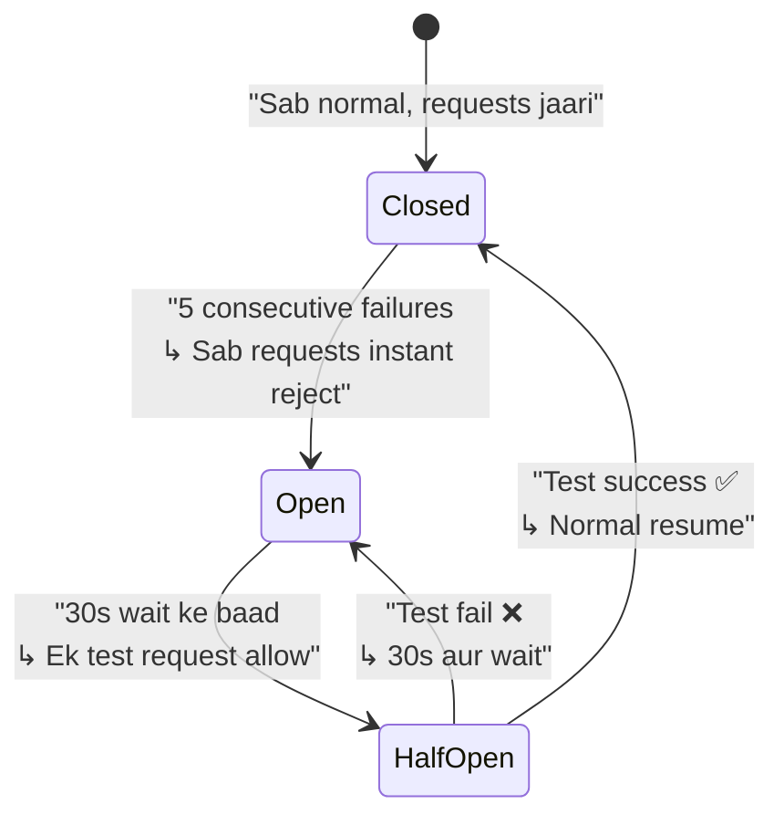
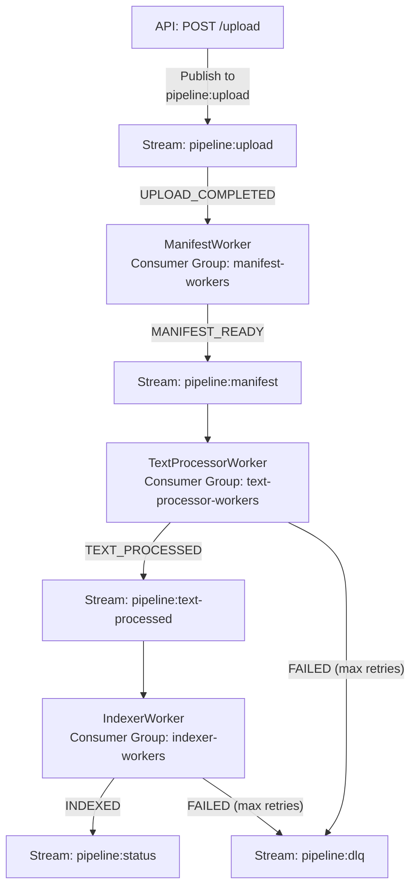

# archadiLM — Architecture Deep Dive

Yeh document tera pura system samjhne ke liye hai — har folder kya karta hai, kyon banaya gaya, kaunsa pattern use ho raha hai aur kyon, security kaise handle ho rahi hai, aur system ko scale kaise kiya ja sakta hai.

---

## 1. Kyon 3 Alag Services? (Distributed Architecture ka Idea)



### Problem Statement

Ek hi process mein sab kuch rakhte to kya hota?

1. **Language mismatch**: Go best hai HTTP servers, concurrency, systems programming ke liye. Python best hai ML/AI ke liye (OpenAI SDK, Mem0, PyMuPDF, HuggingFace — sab Python ecosystem mein hai). Ek language mein dono karne se compromise hota.

2. **Scaling independently**: Chat queries aur document indexing ki load patterns bilkul alag hain. Jab 100 users chat kar rahe hain tab shayad koi document upload nahi ho raha. Alag services hone se tu **dono ko independent scale** kar sakta hai.

3. **Fault isolation**: Agar Python AI service crash kare (OOM, model error, etc.), Go API service alive rehti hai aur proper error return karti hai (circuit breaker ke through). Monolith mein pura system girta.

4. **Deploy independently**: AI service ka model change karna hai? Sirf Python service redeploy karo. Go backend ko touch karne ki zarurat nahi.

### Teeno Services ka Role

| Service | Language | Responsibility | Analogy |
|---|---|---|---|
| **apps/api** | Go | User-facing REST API — auth, CRUD, chat orchestration, SSE streaming | 🏪 Shopkeeper — customer se baat karta hai |
| **apps/worker** | Go | Background document processing pipeline | 🏭 Factory — peeche se saman banata hai |
| **apps/ai-service** | Python | Pure ML compute — embeddings, LLM calls, guardrails, memory | 🧠 Brain — compute karta hai, data store nahi karta |

> [!IMPORTANT]
> **AI Service is STATELESS** — it never reads/writes to Postgres, never knows about users, conversations, or documents. It just receives text → returns AI output. All persistence is Go's responsibility.

---

## 2. Clean Architecture (Folder-by-Folder Breakdown)

The Go backend follows **Clean Architecture** (also called Hexagonal Architecture or Ports & Adapters).

### Core Idea

Imagine concentric circles:
- **Innermost circle** = business rules (entities, interfaces)
- **Middle circle** = use cases (application logic)
- **Outermost circle** = frameworks, databases, HTTP, external APIs

**Rule**: Dependencies ONLY point inward. The inner layers never import outer layers.



---

### `internal/domain/` — The Inner Circle (Business Rules)

**Yeh layer ko kisi external cheez ka pata nahi hai. Na database, na HTTP, na Redis, na OpenAI.**

#### [domain/entities/](file:///b:/Personal-Projects/GenAI/Course-Bot/internal/domain/entities)

Business objects with their own rules. **11 entity files:**

| Entity | File | Key Responsibility |
|---|---|---|
| **User** | [user.go](file:///b:/Personal-Projects/GenAI/Course-Bot/internal/domain/entities/user.go) | UserID, email, password hash, role |
| **Workspace** | [workspace.go](file:///b:/Personal-Projects/GenAI/Course-Bot/internal/domain/entities/workspace.go) | Multi-tenancy boundary — every user gets one workspace |
| **Conversation** | [conversation.go](file:///b:/Personal-Projects/GenAI/Course-Bot/internal/domain/entities/conversation.go) | One "notebook" — owns its own documents, messages, citations |
| **Document** | [document.go](file:///b:/Personal-Projects/GenAI/Course-Bot/internal/domain/entities/document.go) | One uploaded source (PDF, URL, SRT, etc.) with **state machine** |
| **Job** | [job.go](file:///b:/Personal-Projects/GenAI/Course-Bot/internal/domain/entities/job.go) | One unit of pipeline work with its own **state machine** |
| **Chunk** | [chunk.go](file:///b:/Personal-Projects/GenAI/Course-Bot/internal/domain/entities/chunk.go) | One text segment ready for embedding/retrieval |
| **Message** | [conversation.go](file:///b:/Personal-Projects/GenAI/Course-Bot/internal/domain/entities/conversation.go) | One user or assistant message in a conversation |
| **Citation** | [conversation.go](file:///b:/Personal-Projects/GenAI/Course-Bot/internal/domain/entities/conversation.go) | Links an assistant message to the chunk it cited |
| **LearningNode** | [learning_node.go](file:///b:/Personal-Projects/GenAI/Course-Bot/internal/domain/entities/learning_node.go) | Flashcard, quiz, mind map, etc. |

##### State Machines — Why?

Document aur Job dono ke andar **finite state machines** hain:



**Kyon?** Bina state machine ke, ek bug accidentally document ko "INDEXED" bana sakta hai bina embedding hue. State machine code level pe enforce karta hai ki transitions sirf valid paths pe ho sakte hain:

```go
// document.go — Only these edges are allowed
var validDocumentTransitions = map[DocumentStatus][]DocumentStatus{
    DocumentStatusUploading: {DocumentStatusUploaded, DocumentStatusFailed},
    DocumentStatusUploaded:  {DocumentStatusParsing},
    // ...cannot skip from UPLOADED → INDEXED!
}
```

`TransitionTo()` method illegal transition pe error return karta hai. **Business rule domain mein hai, application layer mein nahi.** Iska matlab chahe worker ho ya API, koi bhi accidentally wrong transition nahi kar sakta.

---

#### [domain/provider/](file:///b:/Personal-Projects/GenAI/Course-Bot/internal/domain/provider)

**Port interfaces** — "I need this capability, I don't care who provides it."

| Interface | File | Methods | Implemented By |
|---|---|---|---|
| `LLMProvider` | [ai_provider.go](file:///b:/Personal-Projects/GenAI/Course-Bot/internal/domain/provider/ai_provider.go#L41-L44) | `Generate()`, `Stream()` | `llm.Client` (talks to Python AI Service) |
| `EmbeddingProvider` | [ai_provider.go](file:///b:/Personal-Projects/GenAI/Course-Bot/internal/domain/provider/ai_provider.go#L50-L52) | `Embed()` | `llm.Client` |
| `GuardrailProvider` | [ai_provider.go](file:///b:/Personal-Projects/GenAI/Course-Bot/internal/domain/provider/ai_provider.go#L85-L88) | `CheckPII()`, `CheckInjection()` | `llm.Client` |
| `EvaluatorProvider` | [ai_provider.go](file:///b:/Personal-Projects/GenAI/Course-Bot/internal/domain/provider/ai_provider.go#L95-L97) | `Evaluate()` | `llm.Client` |
| `RerankerProvider` | [ai_provider.go](file:///b:/Personal-Projects/GenAI/Course-Bot/internal/domain/provider/ai_provider.go#L69-L71) | `Rerank()` | `llm.Client` |
| `Queue` | [infra.go](file:///b:/Personal-Projects/GenAI/Course-Bot/internal/domain/provider/infra.go#L24-L30) | `Publish()`, `Consume()` | `redis.Queue` |
| `VectorStore` | [infra.go](file:///b:/Personal-Projects/GenAI/Course-Bot/internal/domain/provider/infra.go#L65-L70) | `Upsert()`, `Search()`, `Delete*()` | `qdrant.Store` |
| `ObjectStore` | [infra.go](file:///b:/Personal-Projects/GenAI/Course-Bot/internal/domain/provider/infra.go#L77-L84) | `Put()`, `Get()`, `Signed*URL()` | `r2.Store` |

**Kyon interfaces?** Agar kal Qdrant ki jagah Pinecone lagana ho, sirf `infrastructure/qdrant/` change karo. `application/chat/` ko pata bhi nahi chalega because woh `provider.VectorStore` interface se baat karta hai, concrete type se nahi.

##### Design choice: VectorStore.Search() forces conversationID

```go
Search(ctx context.Context, conversationID string, query Vector, topK int)
```

`conversationID` **required** hai — empty string allow nahi. Iska matlab ek conversation ka query **kabhi** doosre conversation ke documents se results nahi la sakta. Yeh **data isolation at the type level** hai — bug likh hi nahi sakta because compiler hi reject karega.

---

#### [domain/repository/](file:///b:/Personal-Projects/GenAI/Course-Bot/internal/domain/repository)

Same concept as providers — interfaces for persistence:

```go
// Every workspace-scoped read takes WorkspaceID — no "get by ID only" exists
type DocumentRepository interface {
    GetByID(ctx context.Context, ws WorkspaceID, id string) (*entities.Document, error)
    // GetByIDInternal — only for trusted workers, not user-facing
    GetByIDInternal(ctx context.Context, id string) (*entities.Document, error)
}
```

**Security design**: `GetByID()` requires `WorkspaceID`. Ek user doosre user ke documents access nahi kar sakta at the repository level. `GetByIDInternal()` sirf workers ke liye hai (jinke paas workspace context nahi hota).

---

### `internal/application/` — The Middle Circle (Use Cases)

**6 modules**, each owns one use case:

| Module | Files | Responsibility |
|---|---|---|
| [application/auth/](file:///b:/Personal-Projects/GenAI/Course-Bot/internal/application/auth) | service.go | Register, login, refresh tokens, JWT management |
| [application/chat/](file:///b:/Personal-Projects/GenAI/Course-Bot/internal/application/chat) | service.go | The full RAG query pipeline (`Send()`) |
| [application/upload/](file:///b:/Personal-Projects/GenAI/Course-Bot/internal/application/upload) | service.go | Upload to R2, publish Redis event |
| [application/worker/](file:///b:/Personal-Projects/GenAI/Course-Bot/internal/application/worker) | base.go, manifest.go, text_processor.go, indexer.go, dlq.go, parser_*.go | All 3 pipeline worker stages |
| [application/course/](file:///b:/Personal-Projects/GenAI/Course-Bot/internal/application/course) | service.go | Course management |
| [application/project/](file:///b:/Personal-Projects/GenAI/Course-Bot/internal/application/project) | service.go | Project management |

**Key principle: These call domain interfaces, never infrastructure directly.** `chat.Service` takes `provider.VectorStore`, not `*qdrant.Store`.

---

### `internal/infrastructure/` — The Outer Circle (Adapters)

**9 packages**, each wires one external system:

#### [infrastructure/llm/](file:///b:/Personal-Projects/GenAI/Course-Bot/internal/infrastructure/llm) — The Go↔Python Bridge

[ai_service_client.go](file:///b:/Personal-Projects/GenAI/Course-Bot/internal/infrastructure/llm/ai_service_client.go) is a **758-line HTTP client** that implements 5 interfaces simultaneously:

```go
var (
    _ provider.LLMProvider       = (*Client)(nil)
    _ provider.EmbeddingProvider = (*Client)(nil)
    _ provider.RerankerProvider  = (*Client)(nil)
    _ provider.GuardrailProvider = (*Client)(nil)
    _ provider.EvaluatorProvider = (*Client)(nil)
)
```

Every method:
1. Serializes request to JSON
2. POSTs to Python AI Service endpoint
3. Deserializes response
4. Wraps in circuit breaker + metrics

**26 endpoints exposed**: `/embeddings`, `/generate`, `/evaluate`, `/guardrails/check`, `/enhance-query`, `/hyde-document`, `/extract-pdf`, `/extract-url`, `/classify-intent`, `/memory/search`, `/memory/add`, `/generate-learning-tool`, `/web-search`, `/generate-title`, `/generate-summary`, `/generate-source-intel`, `/rerank`, `/retrieve`

---

#### [infrastructure/resilience/](file:///b:/Personal-Projects/GenAI/Course-Bot/internal/infrastructure/resilience) — Circuit Breaker + Retry

##### Circuit Breaker — Kya Hai aur Kyon Chahiye

**Real-world analogy**: Ghar mein MCB (Miniature Circuit Breaker) hota hai. Agar wire mein short circuit ho jaaye, MCB trip ho jaata hai — pura ghar ka power cut kar deta hai taaki wires na jale. Thodi der baad MCB ko manually reset karte ho. Agar fir se trip ho jaaye, iska matlab problem abhi bhi hai.

Software mein same concept:

**Problem without circuit breaker**: Python AI Service down hai. Go API har request pe 60 second timeout wait karta hai, phir error. 100 concurrent users = 100 connections stuck for 60s each = thread pool exhaustion = **cascading failure** — ab Go API bhi effectively down.

**Solution with circuit breaker**: 5 failures ke baad, circuit breaker **OPEN** ho jaata hai. Ab agle 30 seconds tak Go API **instant error** return karta hai (0ms, no HTTP call). Users ko turant pata chalta hai "service unavailable". 30 seconds baad ek test request jaata hai (half-open). Agar success → circuit close → normal operation resume.



**The code** — [circuit_breaker.go](file:///b:/Personal-Projects/GenAI/Course-Bot/internal/infrastructure/resilience/circuit_breaker.go):

```go
type CircuitBreaker struct {
    maxFailures   int           // kitne failures pe trip hoga (5)
    resetTimeout  time.Duration // kitni der ke baad test karega (30s)
    failures      int           // current consecutive failures
    lastFailTime  time.Time     // last failure timestamp
    state         State         // Closed | Open | HalfOpen
    mu            sync.RWMutex  // thread-safe access
}
```

**`Execute()` method** — har AI call isse gujar ke jaati hai:

```go
func (cb *CircuitBreaker) Execute(ctx context.Context, fn func() error) error {
    if !cb.allow() {
        return ErrCircuitOpen  // Circuit open → instant fail, no HTTP call
    }
    err := fn()               // Circuit closed → actual HTTP call
    cb.recordResult(err)      // Update failure counter
    return err
}
```

**`allow()` method** — state check:
- **Closed** → `return true` (sab kuch allowed)
- **Open** → check agar 30s ho gaye. Haan → switch to HalfOpen, `return true`. Nahi → `return false`
- **HalfOpen** → `return true` (ek test request)

**`recordResult()`** — after each call:
- **Success** → reset failure count to 0. If HalfOpen → switch to Closed
- **Failure** → increment failures. If `failures >= maxFailures` → switch to Open

**6 independent circuit breakers** in `llm.Client`:

| Breaker | Protects These Endpoints |
|---|---|
| `embedCB` | `/embeddings` |
| `extractCB` | `/extract-pdf`, `/extract-url` |
| `generateCB` | `/generate`, `/memory/*` |
| `rerankCB` | `/rerank` |
| `evaluateCB` | `/evaluate` |
| `guardrailCB` | `/guardrails/check` |

**Kyon 6 alag?** Agar embedding endpoint down ho but guardrails endpoint kaam kar raha ho, toh embedding breaker open hoga but guardrails breaker closed rehega. Dono ko independent protect karna chahiye.

##### `callWithMetrics()` — Every AI call goes through this

```go
func (c *Client) callWithMetrics(ctx context.Context, cb *CircuitBreaker, fn func() error) error {
    start := time.Now()
    err := cb.Execute(ctx, fn)             // Circuit breaker wraps the call
    observability.RecordAIServiceCall(      // Metrics for /metrics endpoint
        time.Since(start), err,
    )
    return err
}
```

##### Retry with Exponential Backoff

[retry.go](file:///b:/Personal-Projects/GenAI/Course-Bot/internal/infrastructure/resilience/retry.go) — for transient failures (DB connection blip, network hiccup):

```
Attempt 1: fail → wait 100ms
Attempt 2: fail → wait 200ms (×2)
Attempt 3: fail → wait 400ms (×2)
→ give up
```

**Backoff kyon?** Agar 1000 workers simultaneously retry kare 0ms delay pe, sab same instant mein database ko hit karenge → thundering herd → database crash. Exponential backoff spread karta hai load.

**Context-aware**: Agar context cancel ho gaya (graceful shutdown), retry immediately stop ho jaata hai.

---

#### [infrastructure/redis/](file:///b:/Personal-Projects/GenAI/Course-Bot/internal/infrastructure/redis) — Queue, Cache, JobStore

**3 distinct purposes**, same Redis connection:

##### 1. Queue — [queue.go](file:///b:/Personal-Projects/GenAI/Course-Bot/internal/infrastructure/redis/queue.go)

**Redis Streams** as event backbone. The **only** place in the codebase that imports `go-redis`.

**Consumer Groups kya hai?** Imagine ek WhatsApp group jismein messages aate hain. Consumer group ka matlab hai ki group ke members mein se **sirf ek** ko woh message milega (not all — unlike fan-out). Aur jab tak woh member XACK nahi karega, message pending rehega.

```go
// Publish: XADD pipeline:upload {name: "UPLOAD_COMPLETED", payload: {...}}
func (q *Queue) Publish(ctx context.Context, stream string, e Event) error

// Consume: XREADGROUP GROUP text-processor-workers consumer-1 ...
func (q *Queue) Consume(ctx context.Context, stream, group string) (<-chan QueuedEvent, error)
```

**Kyon Redis Streams (not Kafka/RabbitMQ)?**
- Already using Redis for caching
- Simpler ops (no separate Kafka cluster)
- Consumer groups give exactly-once-delivery semantics
- At current scale (100s of documents, not millions), Redis is more than enough

##### 2. Cache — [cache.go](file:///b:/Personal-Projects/GenAI/Course-Bot/internal/infrastructure/redis/cache.go)

Chat response cache — agar same question repeat ho, RAG pipeline skip karo:

```go
// Key: "chat:v1:{conversationID}:{sha256(query)[:8]}"
// Value: serialized MessageResult JSON
// TTL: 15 minutes
```

**SHA-256 hash** of query ensures deterministic cache keys. `InvalidateConversation()` clears cache when sources are added/deleted.

##### 3. JobStore — [job_store.go](file:///b:/Personal-Projects/GenAI/Course-Bot/internal/infrastructure/redis/job_store.go)

Fast status reads for job polling. Frontend polls `/documents/{id}/status` — instead of hitting Postgres every 2 seconds, read from Redis (sub-millisecond) with Postgres as fallback.

---

#### [infrastructure/postgres/](file:///b:/Personal-Projects/GenAI/Course-Bot/internal/infrastructure/postgres) — All Repository Implementations

**17 files** — one per repository + helpers. Uses `database/sql` + `lib/pq` directly (no ORM).

| File | Implements | Key Queries |
|---|---|---|
| [user_repository.go](file:///b:/Personal-Projects/GenAI/Course-Bot/internal/infrastructure/postgres/user_repository.go) | `UserRepository` | Users, roles, usage stats |
| [document_repository.go](file:///b:/Personal-Projects/GenAI/Course-Bot/internal/infrastructure/postgres/document_repository.go) | `DocumentRepository` | Source CRUD, status transitions, intel storage |
| [chunk_repository.go](file:///b:/Personal-Projects/GenAI/Course-Bot/internal/infrastructure/postgres/chunk_repository.go) | `ChunkRepository` | Batch chunk insert, multi-ID lookup |
| [job_repository.go](file:///b:/Personal-Projects/GenAI/Course-Bot/internal/infrastructure/postgres/job_repository.go) | `JobRepository` | Pipeline job tracking |
| [conversation_repository.go](file:///b:/Personal-Projects/GenAI/Course-Bot/internal/infrastructure/postgres/conversation_repository.go) | `ConversationRepository` | Conversations with workspace isolation |
| [message_repository.go](file:///b:/Personal-Projects/GenAI/Course-Bot/internal/infrastructure/postgres/message_repository.go) | `MessageRepository` | Chat history |
| [citation_repository.go](file:///b:/Personal-Projects/GenAI/Course-Bot/internal/infrastructure/postgres/citation_repository.go) | `CitationRepository` | Batch citation insert |
| [migrate.go](file:///b:/Personal-Projects/GenAI/Course-Bot/internal/infrastructure/postgres/migrate.go) | — | Auto-migration on startup |
| [cursor.go](file:///b:/Personal-Projects/GenAI/Course-Bot/internal/infrastructure/postgres/cursor.go) | — | Cursor-based pagination (not OFFSET — scalable!) |

**Cursor pagination kyon (not OFFSET)?** `OFFSET 10000` in SQL means DB reads 10000 rows and discards them. Cursor pagination uses `WHERE id > last_seen_id LIMIT 50` — always O(50) regardless of page number.

---

#### [infrastructure/qdrant/](file:///b:/Personal-Projects/GenAI/Course-Bot/internal/infrastructure/qdrant) — Vector Database

Implements `provider.VectorStore`. Uses Qdrant's HTTP API directly.

- **Upsert**: Worker sends chunk embeddings (1536-dim vectors) with metadata (conversationID, documentID, timestamp)
- **Search**: Chat service queries with cosine similarity, filtered by conversationID
- **Delete**: When document/conversation is deleted, vectors are cleaned up

---

#### [infrastructure/r2/](file:///b:/Personal-Projects/GenAI/Course-Bot/internal/infrastructure/r2) — Object Storage

Implements `provider.ObjectStore`. Uses AWS SDK v2 (Cloudflare R2 is S3-compatible).

- `raw/` — immutable uploaded files (PDFs, SRTs, etc.)
- `processed/` — normalized documents, generated artifacts
- **Signed URLs**: Frontend never talks to R2 directly. Go API generates short-lived signed URLs.

---

#### [infrastructure/security/](file:///b:/Personal-Projects/GenAI/Course-Bot/internal/infrastructure/security) — Auth & Crypto

| File | What | Details |
|---|---|---|
| [jwt.go](file:///b:/Personal-Projects/GenAI/Course-Bot/internal/infrastructure/security/jwt.go) | JWT signing/verification | HS256, hand-rolled (no external JWT library). Short-lived access tokens (minutes, not hours). |
| [password.go](file:///b:/Personal-Projects/GenAI/Course-Bot/internal/infrastructure/security/password.go) | Password hashing | PBKDF2-HMAC-SHA256, **210,000 iterations** (OWASP 2023 recommendation). Hand-rolled because `golang.org/x/crypto` wasn't reachable during development. |
| [refresh_token.go](file:///b:/Personal-Projects/GenAI/Course-Bot/internal/infrastructure/security/refresh_token.go) | Refresh token generation | Secure random bytes, SHA-256 hashed for storage |

**Why hand-rolled JWT?** No external dependency (`golang-jwt`). One file, 99 lines, pure stdlib. Uses `subtle.ConstantTimeCompare` to prevent timing attacks.

**Password hashing detail**: 
```
Format: "pbkdf2-sha256$210000$<salt-b64>$<hash-b64>"
```
Iteration count embedded in hash → can increase later without invalidating existing hashes.

---

#### [infrastructure/observability/](file:///b:/Personal-Projects/GenAI/Course-Bot/internal/infrastructure/observability) — Monitoring

| File | What |
|---|---|
| [metrics.go](file:///b:/Personal-Projects/GenAI/Course-Bot/internal/infrastructure/observability/metrics.go) | Atomic counters for processing times, error counts, AI service latency. Exposed at `GET /metrics`. Uses `sync/atomic` for lock-free concurrent updates. |
| [sentry.go](file:///b:/Personal-Projects/GenAI/Course-Bot/internal/infrastructure/observability/sentry.go) | Sentry error tracking integration |

---

### `internal/interfaces/` — Inbound Adapters

#### [interfaces/http/](file:///b:/Personal-Projects/GenAI/Course-Bot/internal/interfaces/http) — REST API Surface

**13 files**, no framework — uses Go 1.22+ stdlib `ServeMux`:

| File | Responsibility |
|---|---|
| [router.go](file:///b:/Personal-Projects/GenAI/Course-Bot/internal/interfaces/http/router.go) | Route registration, middleware chain, healthz, metrics |
| [middleware.go](file:///b:/Personal-Projects/GenAI/Course-Bot/internal/interfaces/http/middleware.go) | JWT auth extraction |
| [middleware_recovery.go](file:///b:/Personal-Projects/GenAI/Course-Bot/internal/interfaces/http/middleware_recovery.go) | Panic recovery → 500 |
| [rate_limiter.go](file:///b:/Personal-Projects/GenAI/Course-Bot/internal/interfaces/http/rate_limiter.go) | Token bucket rate limiting (60 req/10 burst) |
| [auth_handlers.go](file:///b:/Personal-Projects/GenAI/Course-Bot/internal/interfaces/http/auth_handlers.go) | Register, login, refresh |
| [chat_handlers.go](file:///b:/Personal-Projects/GenAI/Course-Bot/internal/interfaces/http/chat_handlers.go) | Chat send (SSE), conversation CRUD |
| [upload_handlers.go](file:///b:/Personal-Projects/GenAI/Course-Bot/internal/interfaces/http/upload_handlers.go) | File upload, document management |
| [status_handler.go](file:///b:/Personal-Projects/GenAI/Course-Bot/internal/interfaces/http/status_handler.go) | Job status polling |
| [admin_handlers.go](file:///b:/Personal-Projects/GenAI/Course-Bot/internal/interfaces/http/admin_handlers.go) | Admin-only cache clear, user management |
| [learning_handler.go](file:///b:/Personal-Projects/GenAI/Course-Bot/internal/interfaces/http/learning_handler.go) | Learning tools (flashcards, quizzes) |

---

## 3. Worker Pipeline — Deep Dive

### Redis Streams Event Flow



### Worker Failure Handling

```
Attempt 1: process() → error
  ↳ job.Status = RETRYING
  ↳ sleep(1 × 1 × 2 = 2s)   ← quadratic backoff

Attempt 2: process() → error
  ↳ job.Status = RETRYING
  ↳ sleep(2 × 2 × 2 = 8s)

Attempt 3: process() → error (max reached!)
  ↳ job.Status = DEAD_LETTERED
  ↳ document.Status = FAILED
  ↳ Publish FAILED event to pipeline:status
  ↳ SendToDLQ() → event saved to pipeline:dlq
```

**DLQ (Dead Letter Queue)** — failed events are NOT lost. `RetryFromDLQ()` can republish the original event to retry later (operator-triggered).

---

## 4. Security Measures — Complete List

### Authentication & Authorization

| Layer | What | How |
|---|---|---|
| **Password hashing** | PBKDF2-HMAC-SHA256, 210K iterations | [password.go](file:///b:/Personal-Projects/GenAI/Course-Bot/internal/infrastructure/security/password.go) |
| **JWT tokens** | HS256, short TTL | [jwt.go](file:///b:/Personal-Projects/GenAI/Course-Bot/internal/infrastructure/security/jwt.go) |
| **Refresh tokens** | SHA-256 hashed before storage | [refresh_token.go](file:///b:/Personal-Projects/GenAI/Course-Bot/internal/infrastructure/security/refresh_token.go) |
| **Constant-time comparison** | Timing attack prevention | `subtle.ConstantTimeCompare` in JWT + password verify |
| **Workspace isolation** | Every query scoped to workspace | `WorkspaceID` required in all repository methods |
| **Admin role** | Separate middleware + route group | `RequireAdmin` middleware |

### Input Validation & Guardrails

| Layer | What | Where |
|---|---|---|
| **Prompt injection detection** | LLM-based classification | [guardrails/service.py](file:///b:/Personal-Projects/GenAI/Course-Bot/apps/ai-service/app/guardrails) → Groq |
| **PII detection** | Sensitive data filtering | Same guardrails service → Groq |
| **URL SSRF prevention** | Block private IPs, scheme validation, domain whitelist | [ai_service_client.go](file:///b:/Personal-Projects/GenAI/Course-Bot/internal/infrastructure/llm/ai_service_client.go#L642-L696) |
| **PDF size validation** | 50MB max | [ai_service_client.go](file:///b:/Personal-Projects/GenAI/Course-Bot/internal/infrastructure/llm/ai_service_client.go#L556-L563) |
| **Rate limiting** | 60 req/10 burst per IP | [rate_limiter.go](file:///b:/Personal-Projects/GenAI/Course-Bot/internal/interfaces/http/rate_limiter.go) |

### HTTP Security Headers

Applied to **every response** via `SecurityHeaders` middleware:

| Header | Value | Purpose |
|---|---|---|
| `X-Content-Type-Options` | `nosniff` | Prevent MIME-type sniffing |
| `X-Frame-Options` | `DENY` | Prevent clickjacking |
| `X-XSS-Protection` | `1; mode=block` | XSS filter |
| `Strict-Transport-Security` | `max-age=31536000` | Force HTTPS |
| `Content-Security-Policy` | `default-src 'self'` | Restrict resource loading |
| `Referrer-Policy` | `strict-origin-when-cross-origin` | Control referrer leaking |
| `Permissions-Policy` | `camera=(), microphone=()` | Disable unused browser APIs |

### Data Isolation

| Level | Mechanism |
|---|---|
| **Cross-workspace** | `WorkspaceID` in every repository method |
| **Cross-conversation** | `conversationID` required filter in VectorStore.Search |
| **Worker vs API** | Workers use `GetByIDInternal()` (unscoped), API uses `GetByID(ws, id)` (scoped) |
| **R2 access** | Short-lived signed URLs, never direct access |

---

## 5. Scalability Analysis

| Component | Current | How to Scale | When |
|---|---|---|---|
| **Go API** | Single instance | Horizontal — add more instances behind load balancer. Stateless (no in-memory session). | > 1000 concurrent users |
| **Go Workers** | 3 goroutines in 1 process | Redis consumer groups allow N processes. Just start more `apps/worker` instances — Redis distributes messages automatically. | > 50 concurrent document uploads |
| **Python AI Service** | Single instance | Horizontal — add replicas behind LB. Already stateless. | When AI call latency grows |
| **PostgreSQL** | Single instance | Read replicas for API queries. Write master for workers. | > 10K documents |
| **Qdrant** | Single instance | Qdrant Cloud — managed sharding + replication | > 1M vectors |
| **Redis** | Single instance | Redis Cluster if streams get too large. Or switch to Kafka (Queue interface makes this a 1-file change) | > 10K events/minute |
| **R2** | Cloudflare R2 | Already infinitely scalable (object storage) | ∞ |

---

## 6. Go Packages Used

| Package | Purpose | Why Chosen |
|---|---|---|
| `net/http` (stdlib) | HTTP server + router | Go 1.22+ `ServeMux` is powerful enough, no framework needed |
| `database/sql` (stdlib) | Database interface | Standard, works with any SQL driver |
| `sync` (stdlib) | `WaitGroup`, `RWMutex`, `atomic` | Concurrency primitives |
| `crypto/*` (stdlib) | HMAC-SHA256, SHA-256, random bytes | JWT, passwords, hashing |
| `github.com/lib/pq` | PostgreSQL driver | Most mature Go PG driver |
| `github.com/redis/go-redis/v9` | Redis client | Official Redis Go client |
| `github.com/aws/aws-sdk-go-v2` | R2 (S3-compatible) | Official AWS SDK |
| `github.com/getsentry/sentry-go` | Error monitoring | Sentry official |
| `github.com/joho/godotenv` | `.env` file loading | Simple config |

## 7. Python Packages Used (AI Service)

| Package | Purpose |
|---|---|
| `fastapi` + `uvicorn` | Async HTTP server |
| `pydantic` + `pydantic-settings` | Request/response validation + config |
| `openai` | OpenAI API (GPT-4o, embeddings) |
| `groq` | Groq API (Llama-3.1-8b for fast tasks) |
| `qdrant-client` | Vector search |
| `rank-bm25` | BM25 keyword retrieval |
| `mem0ai` | Long-term memory (Mem0) |
| `pymupdf` | PDF text extraction |
| `beautifulsoup4` | Web page scraping |
| `httpx` | Async HTTP client |
| `youtube-transcript-api` | YouTube subtitle extraction |

---

## 8. Pattern Summary

| Pattern | Where | Why |
|---|---|---|
| **Clean Architecture** | Entire `internal/` structure | Dependency inversion, testability, swappable implementations |
| **Circuit Breaker** | `resilience/circuit_breaker.go` → `llm.Client` | Prevent cascading failures when AI service is down |
| **Retry + Exponential Backoff** | `resilience/retry.go` → workers | Handle transient DB/network errors without thundering herd |
| **Dead Letter Queue** | `worker/dlq.go` → Redis `pipeline:dlq` | Never lose failed work — inspect and replay later |
| **State Machine** | `entities/document.go`, `entities/job.go` | Enforce valid lifecycle transitions at compile time |
| **Consumer Groups** | `redis/queue.go` → each worker stage | Exactly-once delivery, horizontal scaling of workers |
| **Fan-Out/Fan-In** | `chat/service.go` goroutines | Concurrent AI calls → merge results → reduce latency |
| **Fire-and-Forget** | `chat/service.go` Mem0 goroutine | Non-blocking background tasks with timeout safety |
| **Cursor Pagination** | `postgres/cursor.go` | Scalable pagination (O(N) vs O(total_rows)) |
| **Strategy Pattern** | Python `providers/` | Runtime model selection (Groq vs OpenAI) |
| **Adapter Pattern** | Every `infrastructure/` package | Bridge between domain interfaces and external SDKs |
| **Token Bucket** | `http/rate_limiter.go` | Smooth rate limiting with burst tolerance |
