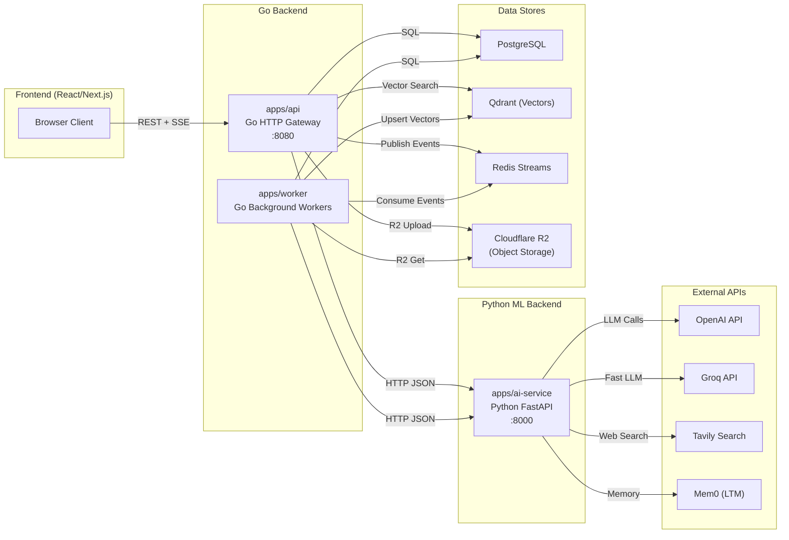
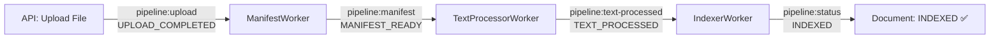
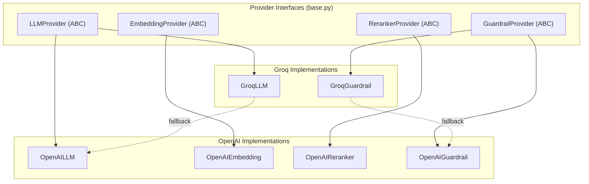
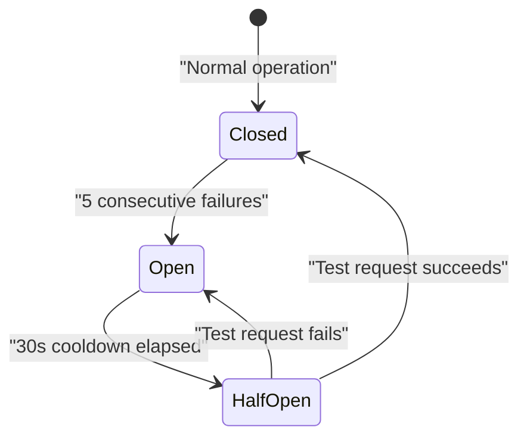
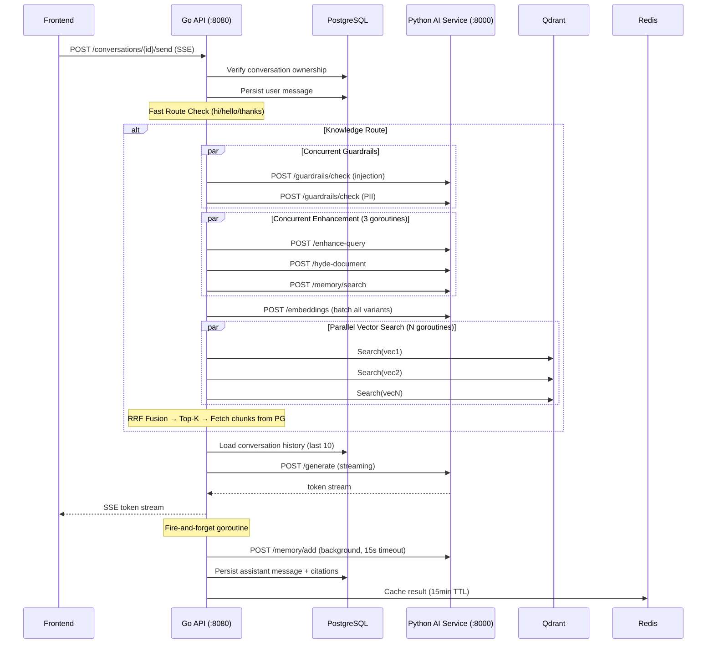

# archadiLM — Full Architecture Deep Dive

## 1. High-Level System Architecture

The project is a **3-service microservice system** with clear separation of concerns:



---

## 2. Architecture Pattern: Clean Architecture + Event-Driven Pipeline

The Go backend follows **Clean Architecture** (Hexagonal/Ports-and-Adapters):

```
internal/
├── domain/          ← Core business rules (entities, interfaces)
│   ├── entities/    ← Business objects: Message, Chunk, Document, Job, etc.
│   ├── provider/    ← Port interfaces: LLMProvider, VectorStore, Queue, etc.
│   └── repository/  ← Repository interfaces: DocumentRepository, JobRepository, etc.
│
├── application/     ← Use cases (orchestration logic)
│   ├── auth/        ← Authentication service
│   ├── chat/        ← RAG query pipeline (the Send function you saw)
│   ├── course/      ← Course management
│   ├── project/     ← Project/workspace management
│   ├── upload/      ← File upload orchestration
│   └── worker/      ← Indexing pipeline workers
│
├── infrastructure/  ← Adapter implementations (external world)
│   ├── id/          ← UUID generator
│   ├── llm/         ← AI Service HTTP client (Go → Python bridge)
│   ├── observability/ ← Sentry + metrics
│   ├── postgres/    ← All repository implementations
│   ├── qdrant/      ← Vector store adapter
│   ├── r2/          ← Cloudflare R2 object storage
│   ├── redis/       ← Redis Streams queue + cache + job store
│   ├── resilience/  ← Circuit breaker + retry utilities
│   └── security/    ← JWT, auth middleware
│
└── interfaces/      ← Inbound adapters (how the world talks to us)
    ├── http/        ← REST API handlers + router + middleware
    ├── grpc/        ← (placeholder for future)
    └── cli/         ← CLI commands
```

### Key Architecture Principles

| Principle | How it's applied |
|---|---|
| **Dependency Inversion** | `application/` depends on `domain/provider` interfaces, not on `infrastructure/` implementations |
| **Ports & Adapters** | `provider.VectorStore` (port) ← `qdrant.Store` (adapter), `provider.Queue` (port) ← `redis.Queue` (adapter) |
| **Thin Controllers** | HTTP handlers in `interfaces/http/` only do request parsing → call service → write response |
| **Service Layer** | Business logic lives in `application/` services (e.g., `chat.Service.Send`) |

---

## 3. Service-by-Service Breakdown

---

### 3.1 `apps/api` — Go HTTP API Gateway

**Role**: The user-facing REST API. Handles auth, CRUD, upload triggers, chat streaming, and status polling. **Never does ML compute directly.**

#### Entrypoint: [main.go](file:///b:/Personal-Projects/GenAI/Course-Bot/apps/api/cmd/api/main.go)

**Boot sequence:**
1. Load config from env/`.env`
2. Connect PostgreSQL + run migrations
3. Connect Redis (queue + cache)
4. Connect Qdrant (vector store)
5. Connect R2 (object storage)
6. Create `llm.Client` (HTTP client to Python AI Service)
7. Wire repositories → application services → HTTP handlers → router
8. Start HTTP server with graceful shutdown (SIGINT/SIGTERM)

#### Key dependencies (Go)

| Package | Purpose |
|---|---|
| `net/http` (stdlib) | HTTP server + routing (no framework — uses Go 1.22+ `ServeMux` pattern matching) |
| `database/sql` + `github.com/lib/pq` | PostgreSQL driver |
| `github.com/redis/go-redis/v9` | Redis client for Streams + caching |
| `github.com/aws/aws-sdk-go-v2` | Cloudflare R2 (S3-compatible object storage) |
| `github.com/getsentry/sentry-go` | Error monitoring |

#### HTTP Middleware Stack (applied in order)

```
Recovery → SecurityHeaders → CORS → Logging → [Auth → RateLimit] → Handler
```

| Middleware | File | What it does |
|---|---|---|
| **Recovery** | [middleware_recovery.go](file:///b:/Personal-Projects/GenAI/Course-Bot/internal/interfaces/http/middleware_recovery.go) | Catches panics, returns 500 |
| **SecurityHeaders** | [router.go](file:///b:/Personal-Projects/GenAI/Course-Bot/internal/interfaces/http/router.go#L66-L79) | X-Frame-Options, HSTS, CSP, etc. |
| **CORS** | [router.go](file:///b:/Personal-Projects/GenAI/Course-Bot/internal/interfaces/http/router.go#L140-L153) | `Access-Control-*` headers for frontend |
| **Logging** | [router.go](file:///b:/Personal-Projects/GenAI/Course-Bot/internal/interfaces/http/router.go#L155-L164) | Request/response timing |
| **RequireAuth** | [middleware.go](file:///b:/Personal-Projects/GenAI/Course-Bot/internal/interfaces/http/middleware.go) | JWT Bearer token validation |
| **RateLimit** | [rate_limiter.go](file:///b:/Personal-Projects/GenAI/Course-Bot/internal/interfaces/http/rate_limiter.go) | Token bucket rate limiting (60 req/10 burst) |

#### Route Map

| Method | Path | Handler | Auth |
|---|---|---|---|
| `GET` | `/healthz` | Health check (Redis, PG, Qdrant, AI circuit breakers) | Public |
| `GET` | `/metrics` | Observability counters | Public |
| `POST` | `/auth/register`, `/auth/login`, `/auth/refresh` | Auth flows | Public |
| `GET` | `/auth/me` | Current user | JWT |
| `POST` | `/conversations/{id}/upload` | File upload → R2 → Redis event | JWT + Rate |
| `POST` | `/conversations/{id}/send` | Chat query (SSE streaming) | JWT + Rate |
| `GET` | `/conversations` | List conversations | JWT + Rate |
| `GET` | `/documents/{id}/status` | Polling job status | JWT + Rate |
| `POST` | `/admin/cache/clear` | Cache management | JWT + Admin |

---

### 3.2 `apps/worker` — Go Background Workers

**Role**: Consumes Redis Stream events and runs the **document indexing pipeline**. Each worker stage runs as a separate goroutine.

#### Entrypoint: [main.go](file:///b:/Personal-Projects/GenAI/Course-Bot/apps/worker/cmd/worker/main.go)

**Boot sequence:**
1. Connect PostgreSQL, Redis, Qdrant, R2
2. Create `llm.Client` (HTTP client to AI Service)
3. Wire 3 workers: `ManifestWorker`, `TextProcessorWorker`, `IndexerWorker`
4. Launch each as a goroutine: `go func() { errs <- worker.Run(ctx) }()`
5. Wait for SIGINT/SIGTERM or fatal error

#### The 3-Stage Indexing Pipeline



#### Stage Details

| Stage | File | Redis Stream | Event In → Event Out | What it does |
|---|---|---|---|---|
| **ManifestWorker** | [manifest.go](file:///b:/Personal-Projects/GenAI/Course-Bot/internal/application/worker/manifest.go) | `pipeline:upload` → `pipeline:manifest` | `UPLOAD_COMPLETED` → `MANIFEST_READY` | Creates parse Job, transitions document to "parsing" |
| **TextProcessorWorker** | [text_processor.go](file:///b:/Personal-Projects/GenAI/Course-Bot/internal/application/worker/text_processor.go) | `pipeline:manifest` → `pipeline:text-processed` | `MANIFEST_READY` → `TEXT_PROCESSED` | Extracts text (SRT/VTT/PDF/URL/DOCX), chunks with sliding window |
| **IndexerWorker** | [indexer.go](file:///b:/Personal-Projects/GenAI/Course-Bot/internal/application/worker/indexer.go) | `pipeline:text-processed` → `pipeline:status` | `TEXT_PROCESSED` → `INDEXED` | Generates metadata, embeddings (OpenAI), source intel, upserts to Qdrant + Postgres |

#### Resilience Patterns in Worker

| Pattern | Implementation | Where |
|---|---|---|
| **Retry with exponential backoff** | `resilience.RetryWithContext()` + quadratic sleep | [base.go](file:///b:/Personal-Projects/GenAI/Course-Bot/internal/application/worker/base.go#L26-L31) |
| **Dead Letter Queue (DLQ)** | After `maxAttempts`, job → `pipeline:dlq` stream | [dlq.go](file:///b:/Personal-Projects/GenAI/Course-Bot/internal/application/worker/dlq.go) |
| **Job State Machine** | `Queued → Running → Succeeded/Retrying → DeadLettered` | [base.go](file:///b:/Personal-Projects/GenAI/Course-Bot/internal/application/worker/base.go#L51-L143) |
| **DLQ Replay** | `RetryFromDLQ()` republishes original event | [dlq.go](file:///b:/Personal-Projects/GenAI/Course-Bot/internal/application/worker/dlq.go#L63-L95) |
| **Redis consumer groups** | Each worker stage is a consumer group (exactly-once delivery) | Each `Run()` method |

---

### 3.3 `apps/ai-service` — Python FastAPI ML Backend

**Role**: Pure ML compute service. Exposes REST endpoints for all AI capabilities. **Has zero knowledge of business entities, users, or persistence.** The Go backend calls it via HTTP.

#### Entrypoint: [main.py](file:///b:/Personal-Projects/GenAI/Course-Bot/apps/ai-service/main.py) → [server.py](file:///b:/Personal-Projects/GenAI/Course-Bot/apps/ai-service/api/server.py)

#### Python Packages

| Package | Purpose |
|---|---|
| `fastapi` + `uvicorn` | Async HTTP server |
| `pydantic` + `pydantic-settings` | Request/response validation + config |
| `openai` | OpenAI API client (LLM, embeddings, reranking) |
| `groq` | Groq API client (fast LLM for guardrails) |
| `qdrant-client` | Vector search (used for hybrid retrieval) |
| `rank-bm25` | BM25 keyword retrieval |
| `mem0ai` | Long-term memory (Mem0 with Qdrant backend) |
| `pymupdf` | PDF text extraction |
| `beautifulsoup4` | Web page text extraction |
| `httpx` | Async HTTP client |
| `youtube-transcript-api` | YouTube subtitle extraction |

#### Service Modules (18 total)

| Module | What it does | Used by |
|---|---|---|
| `embedding/` | OpenAI `text-embedding-3-small` embeddings | Worker (indexing) + API (chat) |
| `evaluator/` | LLM-as-judge quality scoring (1-10) | API (chat, currently unused in Send) |
| `generator/` | Streaming LLM response generation | API (chat) |
| `guardrails/` | Prompt injection + PII detection | API (chat) |
| `hyde/` | Hypothetical document generation | API (chat) |
| `intent_classifier/` | Rule engine + LLM fallback intent routing | API (chat) |
| `learning_tool/` | Flashcards, quizzes, mind maps | API (learning) |
| `memory/` | Mem0 workspace long-term memory | API (chat) |
| `pdf_extractor/` | PyMuPDF text extraction | Worker |
| `providers/` | OpenAI + Groq provider abstraction | All services |
| `query_enhancer/` | Step-back, rewrite, sub-query decomposition | API (chat) |
| `reranker/` | LLM-based cross-encoder reranking | API (chat, currently unused in Send) |
| `retriever/` | Qdrant vector + BM25 hybrid search | API (direct, or via Go) |
| `summary_generator/` | Source intelligence (summary + questions + overview) | Worker (indexing) |
| `title_generator/` | AI document title generation | Worker |
| `url_extractor/` | Web page scraping (BeautifulSoup) | Worker |
| `web_search/` | Tavily real-time web search | API (chat fallback) |

#### Provider Architecture



---

## 4. The Go ↔ Python Bridge: Circuit Breaker Pattern

The [llm.Client](file:///b:/Personal-Projects/GenAI/Course-Bot/internal/infrastructure/llm/ai_service_client.go) is the **single bridge** between Go and Python. Every AI capability goes through this client.

### Circuit Breaker Explained

You saw [circuit_breaker.go](file:///b:/Personal-Projects/GenAI/Course-Bot/internal/infrastructure/resilience/circuit_breaker.go) — here's the intuition:

Think of it like an **MCB in your house** (miniature circuit breaker). If a fuse trips too many times, the MCB opens and stops all current flow. After a cooldown period, it allows one test attempt (half-open). If that succeeds, it closes again.



| State | Behavior |
|---|---|
| **Closed** | All requests pass through normally. Failure counter incremented on errors |
| **Open** | All requests immediately fail with `ErrCircuitOpen` — no HTTP call made. Protects the system from cascading failure |
| **Half-Open** | One "probe" request allowed through. If it succeeds → Closed. If it fails → Open again |

The `llm.Client` has **6 independent circuit breakers** — one per capability:

| Breaker | Protects | Config |
|---|---|---|
| `embedCB` | `/embeddings` | 5 failures → open, 30s reset |
| `extractCB` | `/extract-pdf`, `/extract-url` | Same |
| `generateCB` | `/generate`, `/memory/*` | Same |
| `rerankCB` | `/rerank` | Same |
| `evaluateCB` | `/evaluate` | Same |
| `guardrailCB` | `/guardrails/check` | Same |

Every call goes through `callWithMetrics()` which wraps the circuit breaker AND records latency/errors to `observability.GlobalMetrics` (exposed at `/metrics`).

### Health Check Integration

The `/healthz` endpoint checks if **any** circuit breaker is open:

```go
func (c *Client) Healthy() bool {
    for _, cb := range breakers {
        if cb.State() == StateOpen { return false }
    }
    return true
}
```

---

## 5. Current Model Routing (What's Happening Now)

Looking at [providers/__init__.py](file:///b:/Personal-Projects/GenAI/Course-Bot/apps/ai-service/app/providers/__init__.py):

```python
def get_llm_provider() -> LLMProvider:
    if settings.groq_api_key:
        return GroqLLM()          # ← ALL LLM tasks use Groq
    return OpenAILLM()

def get_embedding_provider() -> EmbeddingProvider:
    return OpenAIEmbedding()      # ← Always OpenAI (1536-dim vectors)

def get_guardrail_provider() -> GuardrailProvider:
    if settings.groq_api_key:
        return GroqGuardrail()    # ← Guardrails use Groq
    return OpenAIGuardrail()
```

The problem: **`get_llm_provider()` returns a single provider** — and that provider is injected into ALL services:

| Service | Current Provider | Model |
|---|---|---|
| `TitleGeneratorService` | GroqLLM | `llama-3.1-8b-instant` |
| `SourceIntelService` | GroqLLM | `llama-3.1-8b-instant` |
| `GeneratorService` (main response!) | GroqLLM | `llama-3.1-8b-instant` |
| `EvaluatorService` | GroqLLM | `llama-3.1-8b-instant` |
| `QueryEnhancerService` | GroqLLM | `llama-3.1-8b-instant` |
| `HydeService` | GroqLLM | `llama-3.1-8b-instant` |
| `IntentClassifierService` | GroqLLM | `llama-3.1-8b-instant` |
| `GuardrailsService` | GroqGuardrail | `llama-3.1-8b-instant` |
| `EmbeddingService` | OpenAIEmbedding | `text-embedding-3-small` ✅ |
| `WorkspaceMemoryService` | OpenAI (hardcoded in Mem0 config) | `gpt-4o-mini` ✅ |

**Groq's `llama-3.1-8b-instant` is a fast but small model — using it for main response generation is trading quality for speed.**

---

## 6. Your Proposed Model Routing: Assessment

Your idea is:
- **Groq** (fast, cheap, 8B model) → guardrails, PII, injection, intent classification, query enhancement, HyDE
- **OpenAI** (smart, expensive, GPT-4o) → main response generation, source intelligence, evaluator

> [!TIP]
> **This is a great idea and a common production pattern called "Model Tiering" or "Cascading Inference".** Companies like Notion, Cursor, and Perplexity all do this — fast cheap models for classification/routing, smart expensive models for generation.

### Cost-Quality-Latency Tradeoff Matrix

| Task | Needs Smarts? | Latency Sensitive? | Recommended Model | Why |
|---|---|---|---|---|
| **Prompt Injection** | Low | Very High (gate) | ✅ Groq (llama-3.1-8b) | Binary classification — small model is enough |
| **PII Detection** | Low | Very High (gate) | ✅ Groq (llama-3.1-8b) | Pattern matching — small model is enough |
| **Intent Classification** | Medium | High | ✅ Groq (llama-3.1-8b) | Rule engine + LLM fallback already handles this |
| **Query Enhancement** | Medium | Medium | Groq is fine, OpenAI better | Sub-query decomposition benefits from reasoning |
| **HyDE Document** | Medium-High | Medium | OpenAI `gpt-4o-mini` would be ideal | Hypothetical doc quality directly affects retrieval |
| **Main Response Gen** | **Very High** | Medium (streamed) | ✅ OpenAI `gpt-4o` | User-facing quality — this is the product |
| **Source Intelligence** | High | Low (async in worker) | ✅ OpenAI `gpt-4o` | Summary/questions need good reasoning |
| **Title Generation** | Medium | Low (async in worker) | Either works | Short output, simple task |
| **Evaluator** | High | Low | ✅ OpenAI `gpt-4o-mini` | Evaluation needs nuance, but mini is enough |
| **Embeddings** | N/A | Medium | ✅ OpenAI (already fixed) | Dimension locked to 1536 for Qdrant |
| **Memory (Mem0)** | Medium | Low (fire-and-forget) | ✅ OpenAI (already hardcoded) | Mem0 config is separate |

### What Needs to Change

The fix is surgical — only [server.py](file:///b:/Personal-Projects/GenAI/Course-Bot/apps/ai-service/api/server.py) initialization needs two providers instead of one:

```python
# Current (single provider for everything):
llm_provider = get_llm_provider()          # → GroqLLM for ALL

# Proposed (tiered):
fast_provider = get_llm_provider()          # → GroqLLM (fast tasks)
smart_provider = get_smart_llm_provider()   # → OpenAILLM (quality tasks)
```

Then wire:
- `GeneratorService(smart_provider)` — main response generation
- `SourceIntelService(smart_provider)` — source intelligence
- `EvaluatorService(smart_provider)` — quality evaluation
- `QueryEnhancerService(fast_provider)` — query enhancement
- `HydeService(fast_provider)` — or `smart_provider` if quality matters
- `TitleGeneratorService(fast_provider)` — titles
- `IntentClassifierService(fast_provider)` — intent

> [!IMPORTANT]
> **No changes needed in the Go backend.** The Go `llm.Client` calls HTTP endpoints on the AI service — it doesn't know or care which model is used behind each endpoint. The routing is entirely a Python-side concern.

---

## 7. Full Request Flow — Chat Query (End-to-End)



---

## 8. Summary

| Service | Language | Role | Port | Architecture Pattern |
|---|---|---|---|---|
| `apps/api` | Go | HTTP Gateway, Auth, Chat orchestration, SSE streaming | `:8080` | Clean Architecture (Hex) |
| `apps/worker` | Go | Background indexing pipeline (3 stages) | N/A (daemon) | Event-Driven Pipeline (Redis Streams) |
| `apps/ai-service` | Python | ML compute (LLM, embeddings, guardrails) | `:8000` | Simple Service Layer |

| Pattern | Where | Purpose |
|---|---|---|
| **Circuit Breaker** | `infrastructure/resilience/` → `llm.Client` | Protect Go from cascading AI Service failures |
| **Retry + Exponential Backoff** | `worker/base.go` | Handle transient DB/infra errors |
| **Dead Letter Queue** | `worker/dlq.go` | Preserve failed jobs for replay |
| **Redis Consumer Groups** | Each worker `Run()` | Exactly-once message delivery |
| **Fan-Out/Fan-In** | `chat/service.go` Send() | Concurrent AI calls + vector search |
| **Fire-and-Forget** | `chat/service.go` Mem0 goroutine | Non-blocking background tasks |
| **Provider Pattern** | Python `providers/` + Go `domain/provider/` | Swappable AI backends |
| **Strategy Pattern** | `get_llm_provider()` / `get_guardrail_provider()` | Runtime model selection |
