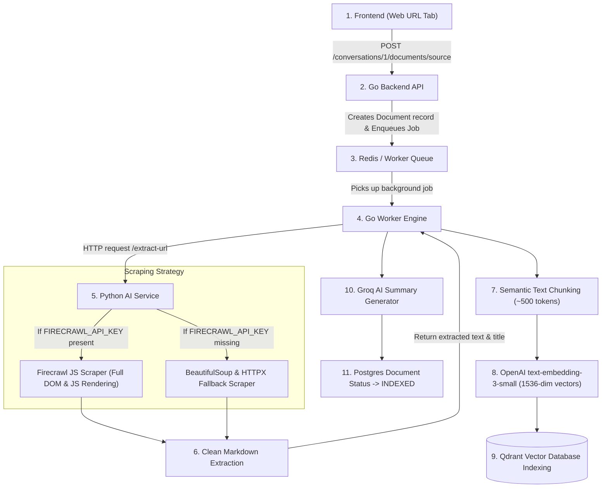

---

### Step-by-Step Technical Execution

1. **📥 Ingestion Trigger**:
   - Frontend posts `{ "source_type": "url", "url": "https://your-website.com" }` to Go API.
   - Postgres creates a document record with status `UPLOADING`.

2. **🕸️ Web Scraping Engine (`apps/ai-service/app/url_extractor/service.py`)**:
   - **Primary Engine (Firecrawl)**: If a `FIRECRAWL_API_KEY` is provided in `.env`, Firecrawl executes a headless browser instance, renders all client-side JavaScript, handles dynamic SPA content, and extracts clean, structured Markdown text.
   - **Fallback Engine**: If no API key is provided, it uses `httpx` + `BeautifulSoup` to fetch raw HTML, strip script/style tags, and parse readable text.

3. **✂️ Chunking & Vectorization**:
   - The worker splits the scraped text into semantic chunks (~500 tokens each with overlapping boundaries).
   - Generates vector embeddings for each chunk using OpenAI `text-embedding-3-small`.

4. **⚡ Qdrant Indexing**:
   - Stores vector embeddings + payload metadata (`conversation_id`, `document_id`, `content`, `source_url`) inside Qdrant.

5. **✨ AI Source Overview**:
   - Groq `llama-3.1-8b-instant` generates an executive summary/overview of the website, which appears as the **Source Overview** card.

6. **💬 Grounded RAG Chat**:
   - When you ask questions about the website, Qdrant retrieves the exact scraped text chunks, feeds them to the LLM as reference material, and returns grounded answers with clickable source citations.